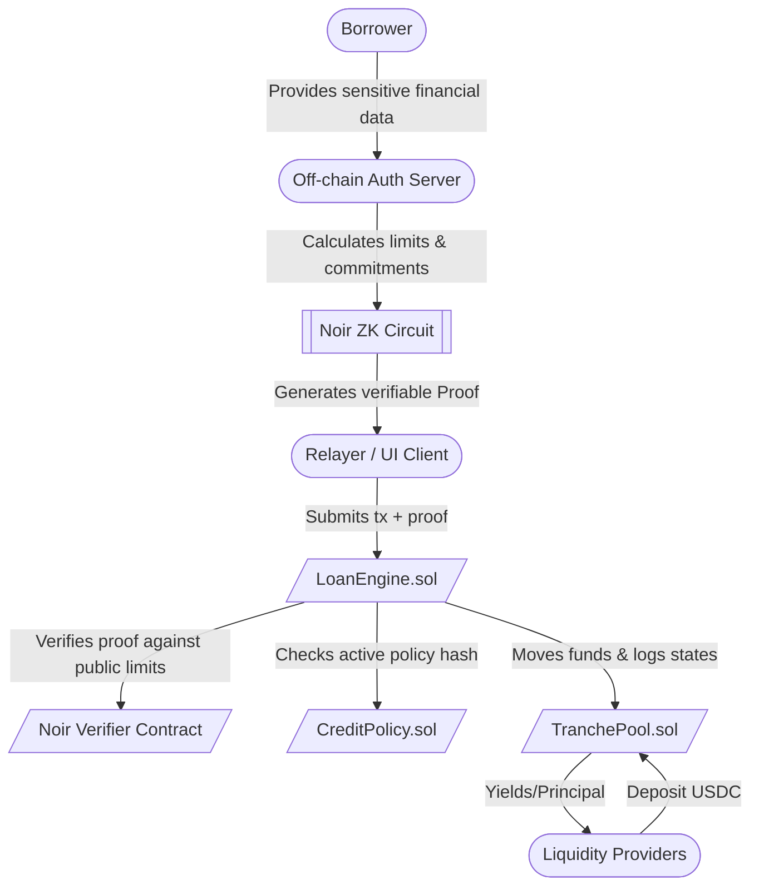

# Credit Rail Architecture

Credit Rail is engineered as a permissioned, production-grade private credit protocol on Ethereum (compatible with EVM and ZKSync). It relies on zero-knowledge execution environments off-chain to certify borrower data, which is then verified against a strict underwriting formula on-chain. 

---

## High-Level Topology

---

## Core Smart Contracts

The entire state machine is centralized into three tightly coupled contracts. The primary system relies on role-based access control (using the OpenZeppelin `AccessControl` and `Ownable` primitives) targeting institutional setups.

### 1. `LoanEngine.sol`
The master orchestrator. This is the only contract that directly updates the lifecycle state of a loan and delegates accounting instructions to the capital pool.

**Loan Lifecycle State Machine:**
1. **CREATED:** A loan is initialized by a valid `createLoan` transaction containing a ZK proof. The proof asserts the borrower meets the configured `CreditPolicy` limits (e.g., maximum term lengths, minimum collateral coverage, restricted industries). It sits in a pending state until reviewed/activated.
2. **ACTIVE:** The `SERVICER_ROLE` approves the loan and funds are allocated from `TranchePool`. Disbursals are sent straight to off-ramping partners. The loan begins to accrue interest.
3. **REPAID:** The borrower sends funds back. The engine registers the repayment, closing the loan account. 
4. **DEFAULTED / WRITTEN_OFF:** If a loan is delinquent, the servicer marks it as a default. A `writeOffLoan` action officially dissolves it from the active ledger, triggering loss allocation in the `TranchePool`.

### 2. `TranchePool.sol`
Handles capital inflows, outflows, and the complex waterfall logic required in structured finance. The architecture abstracts the duplicate logic into a single `TrancheState` struct indexed to three distinct pools: `SENIOR` (index 0), `JUNIOR` (index 1), and `EQUITY` (index 2).

**Key Responsibilities:**
- **LP Deposits & Shares:** Mints a 1:1 "share" tracking system for deposits in an `OPEN` state.
- **Interest Waterfall:** Receives aggregated interest from the `LoanEngine`, distributing it via a *senior-first* approach. The pool tracks "target interest" vs. "accrued interest" to handle real-world scenarios where yield falls behind targets.
- **Loss / Recovery Matrix:** Implements the mathematically critical insolvency absorption mechanism (Equity absorbs first losses, Senior restored first upon recovery).

### 3. `CreditPolicy.sol`
A registry designed for immutable snapshots of fund criteria. The fund protocol administrator versions a policy that maps parameters like maximum concentration limits, attestation thresholds, loan tiers (amount vs. term length), and industry blacklists.

*Important:* The `CreditPolicy` enforces that any newly created active policy gets mathematically hashed (`policyScopeHash`). 

---

## Zero-Knowledge Trust Boundary

The core security principle in Credit Rail revolves around the "trust boundary." 

Why are we using **Noir**?
In traditional DeFi, all checks are public parameters. In a private real-world credit environment, uploading a borrower's net income and business classification violates strict data privacy laws (like GDPR) and reveals valuable proprietary business information. 

1. **The Circuit Constraints:** The circuit takes the `policyScopeHash` (a public parameter on the contract) and the private borrower data.
2. **The Verification:** The verifier contract simply checks the assertion: "A loan originating for `Principal=X` with `APR=Y` on `Date=Z` mathematically satisfies the rigid metrics defined by the on-chain `policyScopeHash`."
3. **Immutability:** Even if the Protocol Administrator maliciously changes the `CreditPolicy` post-origination, historical proofs remain irrefutable, preventing a rug-pull on borrower agreements.

---

## Fuzzing and Invariant Strategy

Due to the extreme complexity of capital flowing backward and forward under varying yields, the protocol employs rigorous invariant testing. Standard unit tests cover state transitions, but deep economic security relies on Foundry invariants natively baked into `test/fuzz/invariant/CreditRailStateFullFuzzTest.t.sol`:

1. **Global Conservation Law:** Idle Capital + Deployed Capital must perfectly sum up to `TotalDeposited - TotalLosses + TotalRecovered`.
2. **Token Solvency:** The actual unbacked USDC token balance inside the `TranchePool` must always `>= Idle Capital`.
3. **Waterfall Symmetry:** No situation should result in a Junior LP receiving interest payments while the Senior LP is experiencing a principal shortfall or missing their target accrued yield.
4. **No Share Inflation:** LP shares uniquely match 1:1 with deposits, meaning a user can maliciously attempt rapid deposits/withdrawals, or fractional yield claims, but cannot artificially mint a single extra share or extract unearned value.
