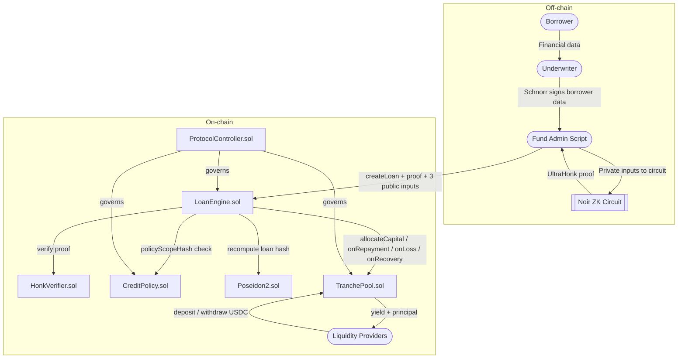

# Credit Rail Architecture

Credit Rail is a permissioned, production-grade private credit protocol. It connects off-chain underwriting decisions to on-chain capital allocation using zero-knowledge proofs to verify loan compliance without exposing borrower data. The system is deployed on zkSync Era (EVM-compatible).

---

## System Topology


```mermaid
graph TD
    subgraph Off-chain
        Borrower([Borrower]) -->|Financial data| Underwriter([Underwriter])
        Underwriter -->|Schnorr signs borrower data| FundAdmin([Fund Admin Script])
        FundAdmin -->|Private inputs to circuit| NoirCircuit[[Noir ZK Circuit]]
        NoirCircuit -->|UltraHonk proof| FundAdmin
    end

    subgraph On-chain
        FundAdmin -->|createLoan + proof + 3 public inputs| LoanEngine[LoanEngine.sol]
        LoanEngine -->|verify proof| HonkVerifier[HonkVerifier.sol]
        LoanEngine -->|policyScopeHash check| CreditPolicy[CreditPolicy.sol]
        LoanEngine -->|recompute loan hash| Poseidon2[Poseidon2.sol]
        LoanEngine -->|allocateCapital / onRepayment / onLoss / onRecovery| TranchePool[TranchePool.sol]
        ProtocolController[ProtocolController.sol] -->|governs| CreditPolicy & LoanEngine & TranchePool
        LPs([Liquidity Providers]) -->|deposit / withdraw USDC| TranchePool
        TranchePool -->|yield + principal| LPs
    end
```

---

## Call Graph

The exact sequence of on-chain calls across the full loan lifecycle:

### Loan Creation
```
Fund Admin → LoanEngine.createLoan()
    → CreditPolicy.policyScopeHash()       [verify policy hash matches proof public input]
    → Poseidon2.hash()                     [recompute loan hash on-chain]
    → HonkVerifier.verify()                [verify ZK proof against public inputs]
    → [store loan struct, mark nullifier used]
```

### Loan Activation
```
Servicer → LoanEngine.activateLoan()
    → TranchePool.allocateCapital()        [move funds: idle → deployed across tranches]
    → IERC20.safeTransfer()                [send principal to whitelisted off-ramping entity]
```

### Repayment
```
Servicer → LoanEngine.repayLoan()
    → LoanEngine._accrueInterest()         [lazy interest accrual up to payment timestamp]
    → IERC20.safeTransferFrom()            [pull funds from whitelisted repayment agent]
    → TranchePool.onRepayment()            [waterfall: interest first, then principal]
```

### Default & Write-off
```
Servicer → LoanEngine.declareDefault()
    → LoanEngine._accrueInterest()         [freeze interest at default timestamp]

Risk Admin → LoanEngine.writeOffLoan()
    → TranchePool.onLoss()                 [loss waterfall: Equity → Junior → Senior]
```

### Recovery
```
Risk Admin → LoanEngine.recoverLoan()
    → IERC20.safeTransferFrom()            [pull from whitelisted recovery agent]
    → TranchePool.onRecovery()             [restore: Senior → Junior → Equity → Equity upside]
```

---

## Upgradeability

All three core contracts (`LoanEngine`, `TranchePool`, `CreditPolicy`) are deployed behind OpenZeppelin `ERC1967Proxy` contracts using the **UUPS (Universal Upgradeable Proxy Standard)** pattern. Each contract:
- Inherits from `Initializable` and `UUPSUpgradeable`
- Replaces its constructor with an `initialize()` function
- Restricts upgrade authorization to `DEFAULT_ADMIN_ROLE` via `_authorizeUpgrade()`
- Calls `_disableInitializers()` in the constructor to prevent direct initialization of the implementation
- Includes a `uint256[50] private __gap` storage gap for future-proof storage layout

In production, `DEFAULT_ADMIN_ROLE` is held exclusively by the `ProtocolController` (a `TimelockController`), meaning upgrades must pass through the governance timelock.

---

## Core Contracts

### `LoanEngine.sol`
The master orchestrator. The only contract that directly manages the loan lifecycle state machine and delegates all capital accounting to `TranchePool`.

**Loan State Machine:**
```
NONE → CREATED → ACTIVE → REPAID
                   ↓
               DEFAULTED → WRITTEN_OFF
```

All state transitions are strictly enforced — no skipping, no reversal. `WRITTEN_OFF` is terminal.

**Interest Accrual:**
Interest is lazy — computed on-demand at the moment of any state-changing call. No keepers or oracles required.

```
accrued += principalOutstanding × aprBps × timeElapsed / (365 days × 10,000)
```

---

### `TranchePool.sol`
Manages LP capital across three tranches. All capital accounting is driven through four functions called exclusively by `LoanEngine`:

| Function | Trigger | Effect |
|---|---|---|
| `allocateCapital()` | `activateLoan()` | Moves idle → deployed (default: 80% Senior / 15% Junior / 5% Equity) |
| `onRepayment()` | `repayLoan()` | Waterfall: interest first, then principal |
| `onLoss()` | `writeOffLoan()` | Loss absorption: Equity first, Junior second, Senior last |
| `onRecovery()` | `recoverLoan()` | Restoration: Senior first, Junior second, Equity last (excess → Equity upside) |

**Interest Waterfall:**
Each tranche has a *target interest* (what it is owed) and *accrued interest* (what has been paid). When a repayment arrives: Senior receives interest until its target is met, then Junior, then Equity receives all remaining residual.

**Loss Waterfall:**
When a loan is written off, principal loss is absorbed from the riskiest tranche first: Equity → Junior → Senior. Ghost interest (interest accrued on a now-defaulted loan) is cancelled in the same order.

**LP Share Model:**
Deposits mint shares 1:1. Interest is tracked via a global index delta per tranche using `InterestMath.computeIndexDelta`, enabling O(1) claim calculation for any LP regardless of pool size.

---

### `CreditPolicy.sol`
An immutable-by-version registry of fund risk parameters. Policies must be frozen before they can be referenced in any loan origination.

**Policy Lifecycle:**
```
ACTIVE → FROZEN → INACTIVE
ACTIVE → INACTIVE
```

Once frozen, a policy is permanently immutable. The `policyScopeHash` — a Poseidon2 hash of all 21 policy parameters — is computed at freeze time and stored on-chain. Every ZK proof must embed this hash as a public input, binding the proof cryptographically to an exact policy version. Even the fund administrator cannot modify the rules a loan was underwritten under.

**What a Policy Contains:**

| Struct | Fields |
|---|---|
| `EligibilityCriteria` | Min revenue, EBITDA, net worth, business age, default count, bankruptcy flag |
| `FinancialRatios` | Max debt-to-EBITDA, min interest coverage, min current ratio, min EBITDA margin |
| `LoanTier` | APR, origination fee, term, revenue bounds, max LTV |
| `ConcentrationLimits` | Max single borrower %, max industry concentration % |
| `AttestationRequirements` | Max attestation age, re-attestation frequency |
| `MaintenanceCovenants` | Leverage ratio, coverage ratio, liquidity, reporting frequency |

---

### `ProtocolController.sol`
A `TimelockController` wrapper that is the ultimate admin of the protocol. In production, the `ProtocolController` acts as the `policyAdmin` of `CreditPolicy`, the `owner` of `TranchePool`, and holds the `DEFAULT_ADMIN_ROLE` on `LoanEngine`. Any critical change — such as updating policy requirements, granting operational roles, or changing pool allocation caps — must be scheduled, pass a configurable delay period, and then be explicitly executed via this timelock. This enforces a governance window that allows LPs to review parameter changes and exit before they take effect.

---

### `InterestMath.sol` (Library)
Three pure math helpers used internally by `TranchePool`:
- `accrueTargetInterest()` — interest accrued over elapsed time at a given APR
- `calculateClaimable()` — an LP's claimable interest from the global index
- `computeIndexDelta()` — the index increment from distributing a payment across all shares

---

## Role Architecture

### `LoanEngine` — OpenZeppelin `AccessControl`

| Role | Who Holds It | What They Can Do |
|---|---|---|
| `UNDERWRITER_ROLE` | Fund admin | `createLoan()` — submit ZK proofs for loan origination |
| `SERVICER_ROLE` | Servicer | `activateLoan()`, `repayLoan()`, `declareDefault()` |
| `RISK_ADMIN_ROLE` | Risk team | `writeOffLoan()`, `declareDefault()` |
| `CONFIG_ADMIN_ROLE` | Governance / multisig | Manage whitelists, update max origination fee |
| `EMERGENCY_ADMIN_ROLE` | Multisig | `pause()`, `unpause()` |

### `TranchePool`
- Admin configuration is governed by `AccessControlUpgradeable` with granular roles:
  - `POOL_ADMIN_ROLE` — pool state transitions, loan engine wiring
  - `CONFIG_ADMIN_ROLE` — allocation factors, APR targets, tranche caps
  - `WHITELIST_ADMIN_ROLE` — LP whitelist management
  - `EMERGENCY_ADMIN_ROLE` — pause/unpause
  - `TREASURY_ROLE` — sweep protocol revenue
- `DEFAULT_ADMIN_ROLE` held by `ProtocolController` in production
- Only the registered `loanEngine` address can call `allocateCapital`, `onRepayment`, `onLoss`, `onRecovery`
- Deposits restricted to whitelisted LP addresses

### `CreditPolicy`
- Uses `AccessControlUpgradeable` with granular roles:
  - `POLICY_ADMIN_ROLE` — create, freeze, and deactivate policy versions
  - `POLICY_EDITOR_ROLE` — update individual policy structs (eligibility, ratios, tiers, etc.)
  - `INDUSTRY_ADMIN_ROLE` — manage industry exclusion lists
- `DEFAULT_ADMIN_ROLE` held by `ProtocolController` in production

---

## Whitelist Architecture

`LoanEngine` enforces four independent whitelists for distinct operational roles:

| Whitelist | Checked In | Purpose |
|---|---|---|
| `whitelistedOffRampingEntities` | `activateLoan()` | Who can receive principal disbursals |
| `whitelistedRepaymentAgents` | `repayLoan()` | Who can be the source of repayment funds |
| `whitelistedRecoveryAgents` | `recoverLoan()` | Who can submit post-default recovery amounts |
| `whitelistedFeeManagers` | `activateLoan()` | Who handles origination fee routing |

Calling any function with a non-whitelisted address reverts immediately. None of these are bypassable.

---

## Off-chain / On-chain Boundary

| Data | Location | Visible On-chain? |
|---|---|---|
| Raw borrower financials (revenue, EBITDA, ratios) | Off-chain only | ❌ Never |
| Underwriter Grumpkin private key | Off-chain only | ❌ Never |
| Schnorr signature components | Off-chain, private circuit input | ❌ Never |
| Proof generation (Barretenberg WASM) | Off-chain, fund admin machine | ❌ Never |
| `policy_version_hash` | Public circuit output | ✅ Yes |
| `loan_hash` | Public circuit output | ✅ Yes |
| `nullifierHash` | Public circuit output | ✅ Yes |
| ZK proof bytes | Submitted in `createLoan` calldata | ✅ Yes |
| Underwriter public key (x, y) | Submitted in `createLoan` params | ✅ Yes |
| Loan terms (principal, APR, fee, term) | Submitted in `createLoan` params | ✅ Yes |

The on-chain `LoanEngine` performs three independent verifications on every `createLoan` call. All three must pass or the transaction reverts:
1. `policy_version_hash` in the proof matches `CreditPolicy.policyScopeHash(policyVersion)`
2. `loan_hash` in the proof matches the Poseidon2 recomputation using the submitted loan params
3. The proof passes `HonkVerifier.verify(proofData, publicInputs)`

---

## ZK Circuit Constraint Summary

The Noir circuit enforces six categories of constraints off-chain before a proof is generated:

| Step | What It Proves |
|---|---|
| 1. Borrower Commitment | `Hash(secret ‖ revenue ‖ EBITDA ‖ net_worth ‖ age)` binds private data to proof |
| 2. Attestation Freshness | Attestation timestamp is within `policy_max_attestation_age_days` of current time |
| 3. Underwriter Signature | Schnorr/Grumpkin signature over borrower data hash is valid against underwriter public key |
| 4. Policy Version Integrity | 21-parameter Poseidon2 hash matches the `policy_version_hash` public input |
| 5. Policy Compliance | All eligibility, ratio, and tier constraints are satisfied by the private borrower data |
| 6. Nullifier Uniqueness | `Hash(loanId ‖ secret ‖ principal ‖ timestamp)` is registered on-chain to prevent replay |

Industry exclusion is checked on-chain in `LoanEngine` rather than inside the circuit — because the exclusion list is dynamic and cannot be embedded in a static frozen policy hash.

For full circuit internals, see [`ZK_PROOF_INTEGRATION.md`](./ZK_PROOF_INTEGRATION.md).

---

## Pool State Machine

```
OPEN → COMMITTED → DEPLOYED → CLOSED
```

| State | Deposits | Withdrawals | Loan Activation |
|---|---|---|---|
| `OPEN` | ✅ | ✅ | ❌ |
| `COMMITTED` | ❌ | ❌ | ✅ |
| `DEPLOYED` | ❌ | ❌ | ✅ |
| `CLOSED` | ❌ | ✅ | ❌ |

State transitions are strictly one-directional and enforced by `TranchePool`.

---

For invariant testing strategy, see [`Invariants.md`](./Invariants.md).
For ZK proof generation and pipeline details, see [`ZK_PROOF_INTEGRATION.md`](./ZK_PROOF_INTEGRATION.md).
